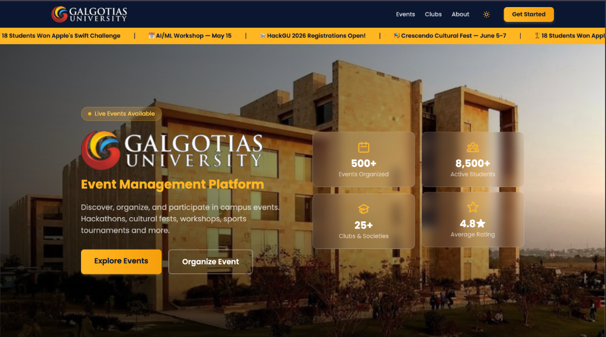
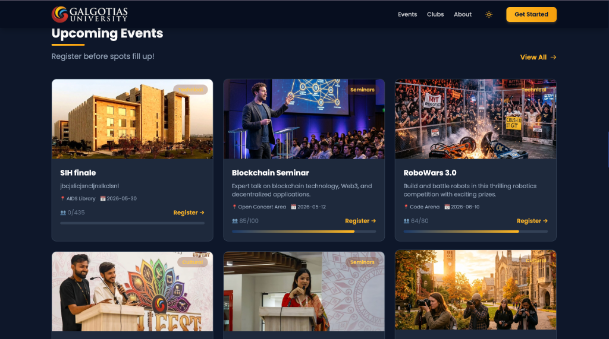
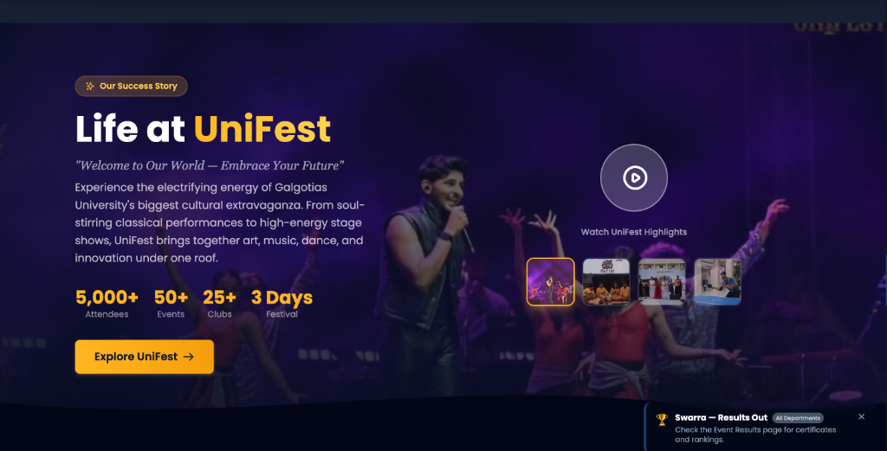
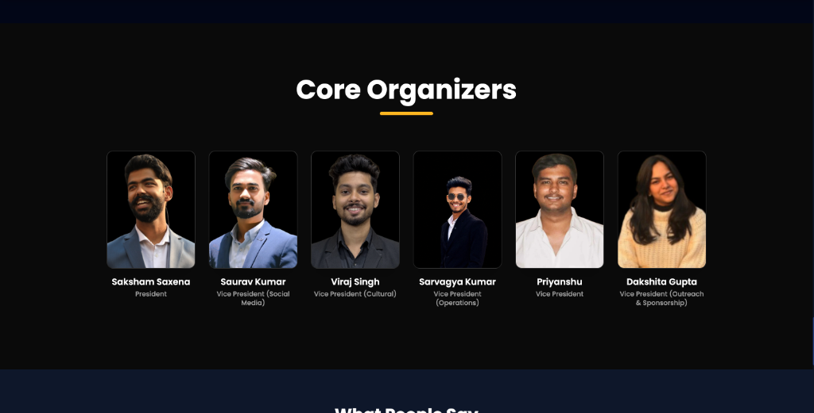
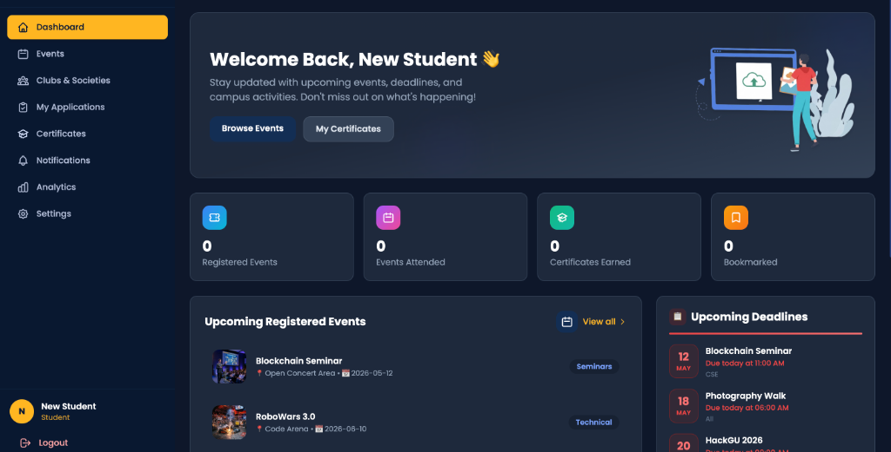
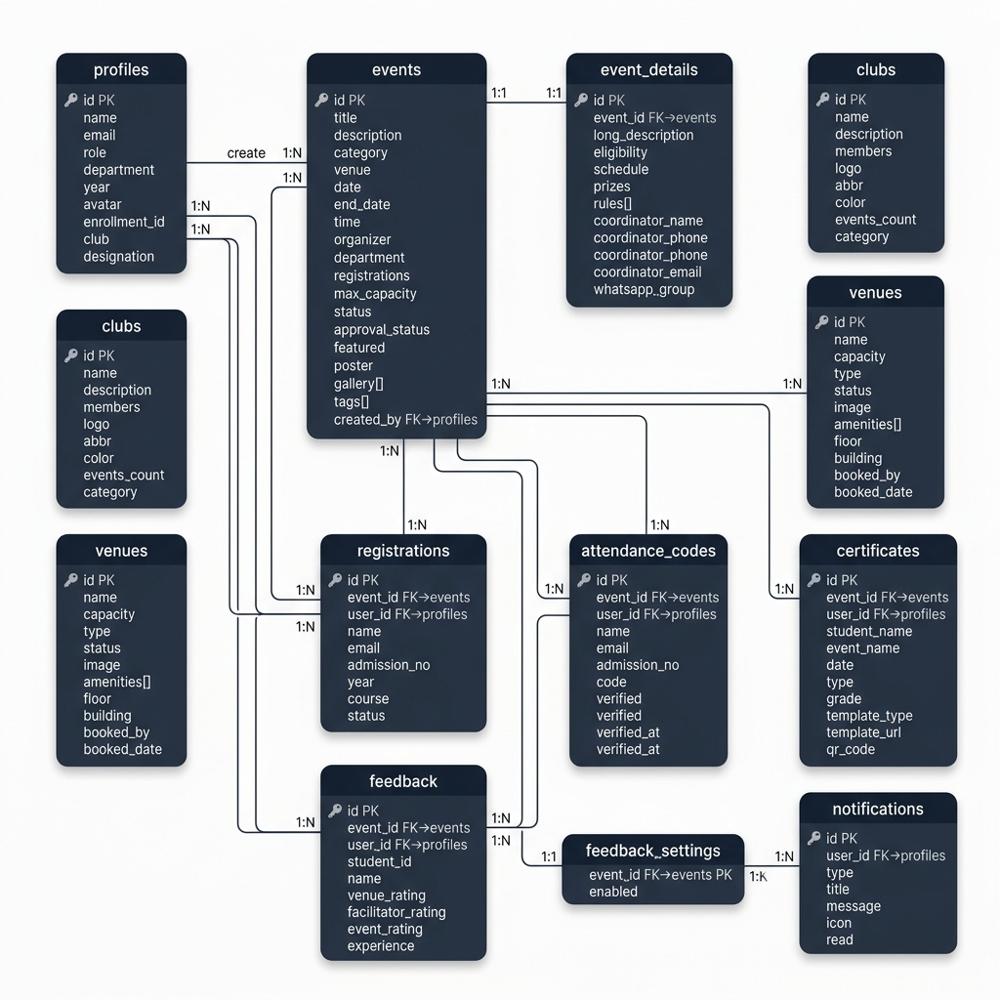

<div align="center">

# 🎓 GU Event Organizer

### *Campus Event Management Platform — Galgotias University*

[](https://gu-eventorganizer.vercel.app/)
[](https://react.dev/)
[](https://supabase.com/)
[](https://vitejs.dev/)
[](https://tailwindcss.com/)
[](https://vercel.com/)

<br/>

> **Discover, organize, and participate in campus events.**  
> Hackathons · Cultural Fests · Workshops · Sports Tournaments · Seminars & more.

<br/>



</div>

---

## 📖 About

**GU Event Organizer** is a full-stack event management platform purpose-built for **Galgotias University**. It streamlines the entire event lifecycle — from creation and approval to registration, attendance tracking, certificate generation, and post-event feedback.

The platform serves **three distinct user roles** — Students, Organizers, and Admins — each with a tailored dashboard experience powered by real-time data and role-based access control.

### 🎯 Why This Project?

Managing events across a university campus with **8,500+ active students** and **25+ clubs** is complex. Paper forms, scattered WhatsApp groups, and manual attendance sheets don't scale. GU Event Organizer centralizes everything into one modern, intuitive platform:

- **Students** discover events, register with a click, receive QR-based attendance codes, and download certificates
- **Organizers** create events, manage registrations, track attendance, and publish results
- **Admins** have full oversight — approve events, manage venues, clubs, and view campus-wide analytics

---

## ✨ Key Features

<table>
  <tr>
    <td width="50%">

### 🗓️ Event Management
- Create, edit, and manage events with rich details
- Multi-day event support with schedules & rules
- Event approval workflow (pending → approved / rejected)
- Featured events & category-based filtering
- Event galleries with poster uploads

</td>
    <td width="50%">

### 👥 Registration System
- One-click event registration for students
- Capacity tracking with live registration counts
- Registration approval workflow for organizers
- Unique QR-code based attendance verification
- Duplicate registration prevention

</td>
  </tr>
  <tr>
    <td width="50%">

### 🏆 Certificates & Results
- Auto-generated certificates with QR verification
- Multiple certificate templates (participation, winner, etc.)
- Event results publishing with grades & rankings
- Downloadable certificates for students

</td>
    <td width="50%">

### 📊 Analytics Dashboard
- Real-time campus event statistics
- Registration trends & attendance analytics
- Department-wise & category-wise breakdowns
- Visual charts powered by Recharts

</td>
  </tr>
  <tr>
    <td width="50%">

### 🏛️ Venue Management
- Browse campus venues with images & amenities
- Venue availability & booking status
- Capacity, floor, and building information
- Venue-wise event history

</td>
    <td width="50%">

### 🎭 Club Management
- Browse 25+ university clubs & societies
- Club membership applications
- Club event tracking & member counts
- Application status tracking for students

</td>
  </tr>
  <tr>
    <td width="50%">

### 🔔 Real-time Notifications
- Live push notifications via Supabase Realtime
- Event reminders & registration confirmations
- Result announcements & certificate availability
- Read/unread status tracking

</td>
    <td width="50%">

### 💬 Feedback System
- Post-event feedback collection
- Multi-dimension ratings (venue, facilitator, event)
- Feedback toggle per event (organizer-controlled)
- Written experience & suggestions

</td>
  </tr>
</table>

---

## 📸 Screenshots

<details>
<summary><b>🏠 Landing Page — Hero Section</b></summary>
<br/>

</details>

<details>
<summary><b>📅 Upcoming Events</b></summary>
<br/>

</details>

<details>
<summary><b>🎪 Life at UniFest</b></summary>
<br/>

</details>

<details>
<summary><b>👨‍💼 Core Organizers</b></summary>
<br/>

</details>

<details open>
<summary><b>📊 Student Dashboard</b></summary>
<br/>

</details>

---

## 🏗️ Tech Stack

| Layer | Technology | Purpose |
|-------|-----------|---------|
| **Frontend** | React 19 + Vite | Fast SPA with latest React features |
| **Styling** | TailwindCSS + Custom Theme | Dark-themed, responsive UI |
| **Animations** | Framer Motion | Smooth page transitions & micro-interactions |
| **Backend** | Supabase (PostgreSQL) | Database, Auth, Storage, Realtime |
| **Auth** | Supabase Auth | Email/password with role-based access |
| **Charts** | Recharts | Interactive data visualizations |
| **Icons** | React Icons | Comprehensive icon library |
| **QR Codes** | react-qr-code | Attendance verification codes |
| **Routing** | React Router v7 | Client-side navigation with protected routes |
| **Email** | EmailJS | Automated email notifications |
| **Deployment** | Vercel | CI/CD with automatic deploys |

---

## 🗄️ Database Design

The application uses **Supabase (PostgreSQL)** with **11 interconnected tables** and **Row Level Security (RLS)** policies on every table for data protection.

### Entity-Relationship Diagram

<div align="center">

</div>

<br/>

<details>
<summary><b>📋 Table Overview (click to expand)</b></summary>

| # | Table | Description | Key Relationships |
|---|-------|-------------|-------------------|
| 1 | `profiles` | User profiles extending Supabase Auth | Base table — referenced by most tables |
| 2 | `events` | Core event data (title, date, venue, status) | `created_by` → profiles |
| 3 | `event_details` | Extended event info (schedule, prizes, rules) | 1:1 with events |
| 4 | `clubs` | University clubs & societies | Standalone |
| 5 | `venues` | Campus venues with capacity & amenities | Standalone |
| 6 | `registrations` | Student event registrations | → events, → profiles |
| 7 | `attendance_codes` | QR-based attendance verification | → events, → profiles |
| 8 | `certificates` | Generated certificates with QR codes | → events, → profiles |
| 9 | `feedback` | Multi-dimensional event feedback | → events, → profiles |
| 10 | `feedback_settings` | Per-event feedback toggle | → events |
| 11 | `notifications` | Real-time user notifications | → profiles |

</details>

### 🔒 Security

- **Row Level Security (RLS)** enabled on all 11 tables
- **Role-based policies**: Students, Organizers, and Admins have different data access levels
- Organizers can only modify their own events; Admins have full access
- Students can only view their own registrations, certificates, and notifications
- Environment variables secured via `.env.local` (never committed to Git)

---

## 🏛️ Architecture

```
┌─────────────────────────────────────────────────────────────────┐
│                         FRONTEND                                │
│  React 19 + Vite + TailwindCSS + Framer Motion                 │
│                                                                 │
│  ┌──────────┐  ┌──────────┐  ┌──────────┐  ┌──────────┐       │
│  │ Landing  │  │ Student  │  │Organizer │  │  Admin   │       │
│  │  Page    │  │Dashboard │  │Dashboard │  │Dashboard │       │
│  └──────────┘  └──────────┘  └──────────┘  └──────────┘       │
│                                                                 │
│  Context Providers: Auth | Events | Clubs | Venues | Certs     │
│  | Registration | Feedback | Notifications | Bookmarks | Toast │
├─────────────────────────────────────────────────────────────────┤
│                        SUPABASE                                 │
│  ┌──────────┐  ┌──────────┐  ┌──────────┐  ┌──────────┐       │
│  │PostgreSQL│  │   Auth   │  │ Storage  │  │ Realtime │       │
│  │    DB    │  │  (JWT)   │  │ (Files)  │  │(Websocket│       │
│  └──────────┘  └──────────┘  └──────────┘  └──────────┘       │
├─────────────────────────────────────────────────────────────────┤
│                       DEPLOYMENT                                │
│  Vercel (Auto-deploy from GitHub) + Supabase Cloud              │
└─────────────────────────────────────────────────────────────────┘
```

---

## 📁 Project Structure

```
GuEventorganizer/
├── public/                    # Static assets
│   ├── clubs/                 # Club logos & images
│   ├── events/                # Event posters & gallery
│   ├── favicon.svg            # App favicon
│   └── *.png / *.jpg          # Campus photos, team photos, slides
├── src/
│   ├── components/
│   │   ├── layout/            # DashboardLayout, Sidebar, Navbar
│   │   ├── ClubRegistrationStatusCard.jsx
│   │   └── JoinClubModal.jsx
│   ├── context/               # 11 React Context providers
│   │   ├── AuthContext.jsx        # Authentication & user state
│   │   ├── EventManagementContext.jsx  # CRUD events
│   │   ├── RegistrationContext.jsx     # Event registrations
│   │   ├── CertificateContext.jsx      # Certificate generation
│   │   ├── ClubManagementContext.jsx   # Club operations
│   │   ├── FeedbackContext.jsx         # Feedback collection
│   │   ├── NotificationContext.jsx     # Push notifications
│   │   ├── VenueContext.jsx            # Venue data
│   │   ├── BookmarkContext.jsx         # Event bookmarks
│   │   ├── ThemeContext.jsx            # Dark/light mode
│   │   └── ToastContext.jsx            # Toast notifications
│   ├── hooks/
│   │   └── useLiveNotifications.js  # Supabase Realtime hook
│   ├── services/
│   │   └── emailService.js    # EmailJS integration
│   ├── pages/                 # 20 page components
│   │   ├── LandingPage.jsx        # Public landing page
│   │   ├── LoginPage.jsx          # Auth page
│   │   ├── StudentDashboard.jsx   # Student home
│   │   ├── OrganizerDashboard.jsx # Organizer home
│   │   ├── AdminDashboard.jsx     # Admin home
│   │   ├── EventsPage.jsx        # Browse events
│   │   ├── EventDetailsPage.jsx   # Single event view
│   │   ├── CreateEventPage.jsx    # Event creation form
│   │   ├── ClubsPage.jsx         # Browse clubs
│   │   ├── ClubDetailsPage.jsx    # Single club view
│   │   ├── VenuesPage.jsx        # Campus venues
│   │   ├── CertificatesPage.jsx   # My certificates
│   │   ├── AnalyticsPage.jsx      # Analytics dashboard
│   │   ├── AttendancePage.jsx     # QR attendance
│   │   ├── EventResultsPage.jsx   # Results & rankings
│   │   └── ...more
│   ├── data/                  # Static data & constants
│   ├── lib/                   # Supabase client config
│   ├── App.jsx                # Root component with routing
│   ├── main.jsx               # Entry point
│   └── index.css              # Global styles
├── supabase/
│   ├── schema.sql             # Complete database schema
│   ├── seed.sql               # Sample data
│   └── *.sql                  # Migration scripts
├── docs/
│   └── screenshots/           # README screenshots
├── .env.local                 # Environment variables (gitignored)
├── tailwind.config.js         # Tailwind configuration
├── vite.config.js             # Vite configuration
├── vercel.json                # Vercel deployment config
└── package.json               # Dependencies & scripts
```

---

## 🚀 Getting Started

### Prerequisites

| Tool | Version | Download |
|------|---------|----------|
| Node.js | v18+ | [nodejs.org](https://nodejs.org/) |
| npm | v9+ | Comes with Node.js |
| Git | Latest | [git-scm.com](https://git-scm.com/) |

### Installation

```bash
# 1. Clone the repository
git clone https://github.com/Baksheeshs/GuEventorganizer.git
cd GuEventorganizer

# 2. Install dependencies
npm install

# 3. Set up environment variables
cp .env.local.example .env.local
# Then fill in your Supabase credentials (see below)

# 4. Start the development server
npm run dev
```

The app will be available at **http://localhost:5173** 🚀

### Environment Variables

Create a `.env.local` file in the project root:

```env
# ─── Supabase Configuration ───
VITE_SUPABASE_URL=<your-supabase-project-url>
VITE_SUPABASE_ANON_KEY=<your-supabase-anon-key>
```

> ⚠️ **Note:** Contact the project owner for Supabase credentials. These are NOT committed to Git for security reasons.

### Setting Up Your Own Supabase Backend

<details>
<summary><b>Click to expand setup instructions</b></summary>
<br/>

1. Create a new project at [supabase.com](https://supabase.com)
2. Go to **SQL Editor** → **New Query**
3. Copy & paste the contents of [`supabase/schema.sql`](supabase/schema.sql) and run it
4. *(Optional)* Run [`supabase/seed.sql`](supabase/seed.sql) to populate sample data
5. Go to **Settings** → **API** and copy:
   - `Project URL` → `VITE_SUPABASE_URL`
   - `anon public key` → `VITE_SUPABASE_ANON_KEY`
6. Paste them in your `.env.local` file

</details>

---

## 📜 Available Scripts

| Command | Description |
|---------|-------------|
| `npm run dev` | Start development server on `localhost:5173` |
| `npm run build` | Create optimized production build |
| `npm run preview` | Preview production build locally |
| `npm run lint` | Run ESLint for code quality checks |

---

## 🛣️ Roadmap

- [x] Landing page with live event ticker
- [x] Role-based authentication (Student / Organizer / Admin)
- [x] Event CRUD with approval workflow
- [x] Registration system with capacity tracking
- [x] QR-code based attendance
- [x] Certificate generation & download
- [x] Real-time notifications (Supabase Realtime)
- [x] Club management & membership applications
- [x] Venue browser with booking status
- [x] Analytics dashboard with Recharts
- [x] Dark mode support
- [x] Feedback system with multi-dimensional ratings
- [ ] Mobile app (React Native)
- [ ] Email reminders for upcoming registered events
- [ ] Calendar integration (Google Calendar / iCal)
- [ ] Bulk certificate generation
- [ ] Event photo gallery uploads by attendees

---

## 🤝 Contributing

Contributions are welcome! Here's how to get started:

```bash
# 1. Fork the repository

# 2. Create a feature branch
git checkout -b feature/amazing-feature

# 3. Make your changes and commit
git commit -m "feat: add amazing feature"

# 4. Push to your branch
git push origin feature/amazing-feature

# 5. Open a Pull Request
```

### Commit Convention

| Prefix | Usage |
|--------|-------|
| `feat:` | New feature |
| `fix:` | Bug fix |
| `docs:` | Documentation changes |
| `style:` | Formatting, no code change |
| `refactor:` | Code restructuring |
| `chore:` | Maintenance tasks |

---

## 📄 License

This project is private and intended for **Galgotias University** use.

---

<div align="center">

**Built with ❤️ for Galgotias University**

<br/>

[](https://github.com/Baksheeshs)
[](https://gu-eventorganizer.vercel.app/)

<br/>

⭐ **Star this repo if you found it useful!** ⭐

</div>
